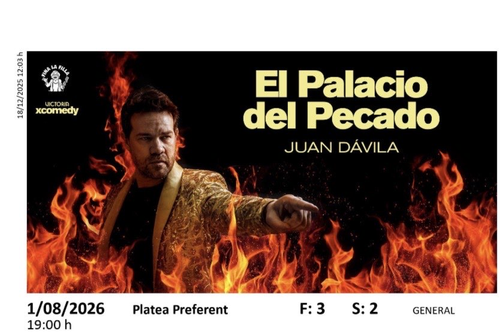

<html lang="es">
<head>
<meta charset="UTF-8">
<title>Misión Secreta 💖</title>

</head>
<body>

<!-- LOGIN -->

  <h2>🔐 Acceso secreto</h2>
  
Pon la contraseña correcta

  
<em>Pista: Serie que finjiste verte para enamorar a este chico joven y guapo</em>

  <input type="password" id="password" placeholder="Contraseña">
   
  <button onclick="comprobar()">Entrar</button>
  
❌ Contraseña incorrecta

<!-- PREGUNTAS -->

  <h2>🧩 Primera prueba</h2>
  
1️⃣ ¿Dónde fue nuestro primer beso?

  <input id="p1">
  
2️⃣ ¿En qué fecha empezamos a salir?

  <input id="p2">
  
3️⃣ ¿Caul es el nombre del mejor jugador de pádel del mundo?

  <input id="p3">
  
4️⃣ ¿Mi película favorita?

  <input id="p4">
  
5️⃣ ¿Nuestro primer viaje juntos?

  <input id="p5">
  <button onclick="verificarPreguntas()">Comprobar</button>
  
❌ Has fallado alguna

<!-- CANCIÓN -->

  <h2>🎶 Prueba musical</h2>
  <audio controls>
    <source src="cancion.mp3" type="audio/mpeg">
  </audio>
  
¿Cómo se llama la canción?

  <input id="respuestaCancion">
  <button onclick="verificarCancion()">Responder</button>
  
❌ No es esa

<!-- CÓDIGO DEL AMOR -->

  <h2>🗝️Ordena correctamente</h2>
  
Ordena de MÁS ANTIGUO a MÁS RECIENTE

  
1️⃣ Primer spa juntos  2️⃣ Vamos a ver a BadBo 3️⃣ Primer viaje juntos  4️⃣ La munch y la Mar se conocen

  <input id="codigoRespuesta" placeholder="Ej: 1-2-3-4">
  <button onclick="verificarCodigo()">Comprobar</button>
  
❌ No es correcto

<!-- VERDADERO / FALSO -->

  <h2>✔️ Verdadero o Falso</h2>

  
Yo te pedí salir a ti (definitivamente)

  <select id="vf1"><option value="">---</option><option>V</option><option>F</option></select>

  
Nuestro primer concierto fue Funzo y Babyloud

  <select id="vf2"><option value="">---</option><option>V</option><option>F</option></select>

  
En nuestra primera cena en tu casa tu madre hizo tortilla

  <select id="vf3"><option value="">---</option><option>V</option><option>F</option></select>

  
Nuestra primera vez que quedamos fuimos al cine

  <select id="vf4"><option value="">---</option><option>V</option><option>F</option></select>

  <button onclick="verificarVF()">Comprobar</button>
  
❌ Alguna no es correcta

<!-- RETOS CHECKBOX -->

  <h2>✅ Última prueba</h2>
  
Completa TODOS los retos:

  

    <label><input type="checkbox" id="r1"> Darle algo de comer a tu querido novio</label>
  

  

    <label><input type="checkbox" id="r2"> Darle un beso (con sentimiento) a todas las personas de la sala</label>
  

  

    <label><input type="checkbox" id="r3"> Hacer 5 flexiones</label>
  

  <button onclick="verificarRetos()">Hecho</button>
  
❌ Faltan retos por cumplir

<!-- ELECCIÓN DEL REGALO -->

  <h2>🎁 Elige tu regalo</h2>
  
Solo uno es el correcto… elige sabiamente 😏

  <button onclick="fallo(1)">🎁 Regalo 1</button>
  <button onclick="fallo(2)">🎁 Regalo 2</button>
  <button onclick="fallo(3)">🎁 Regalo 3</button>
  <button onclick="fallo(4)">🎁 Regalo 4</button>
  <button onclick="fallo(5)">🎁 Regalo 5</button>
  <button onclick="fallo(6)">🎁 Regalo 6</button>
  <button onclick="acierto()">🎁 Regalo 7</button>
  <button onclick="fallo(8)">🎁 Regalo 8</button>

<!-- RESULTADO FALLOS -->

  <h2>❌ Casi…</h2>
  
  

  <button onclick="volverIntentar()">Volver a intentar</button>

<!-- RESULTADO ACIERTO -->

  <h2>🎉 ¡Has acertado!</h2>
  
  
Tu regalo es… <strong>RESERVA ESA FECHA, QUE NOS VAMOS A VER AL JUAN DAVILA</strong>

</body>
</html>
